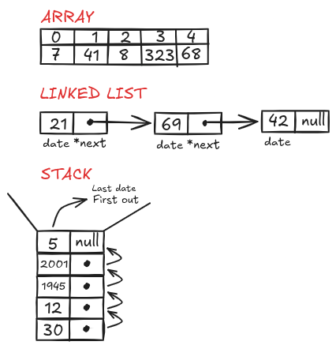

# Dibujo de estructuras

- **Instagram:** usa Grafos en su sistema de seguidores, ya que al seguir a una persona(usuario) hay una conexion, y puede varias conexiones como seguidores en comun, o amigos. 

- **Kick:** usa cola ya que en los chats y transmisiones en vivo, los mensajes llegan continuamente y estos deben enviarse en orden de llegada. 

- **ikTok:** usa listas enlazadas, ya que los videos que te muestran se maneja de forma secuencial, uno por uno.

